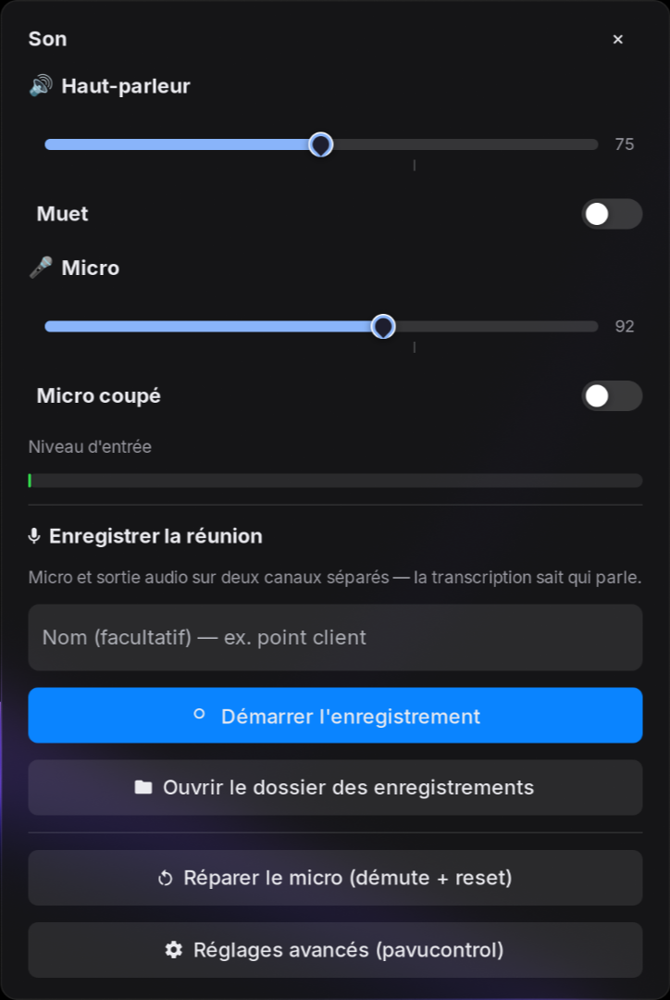
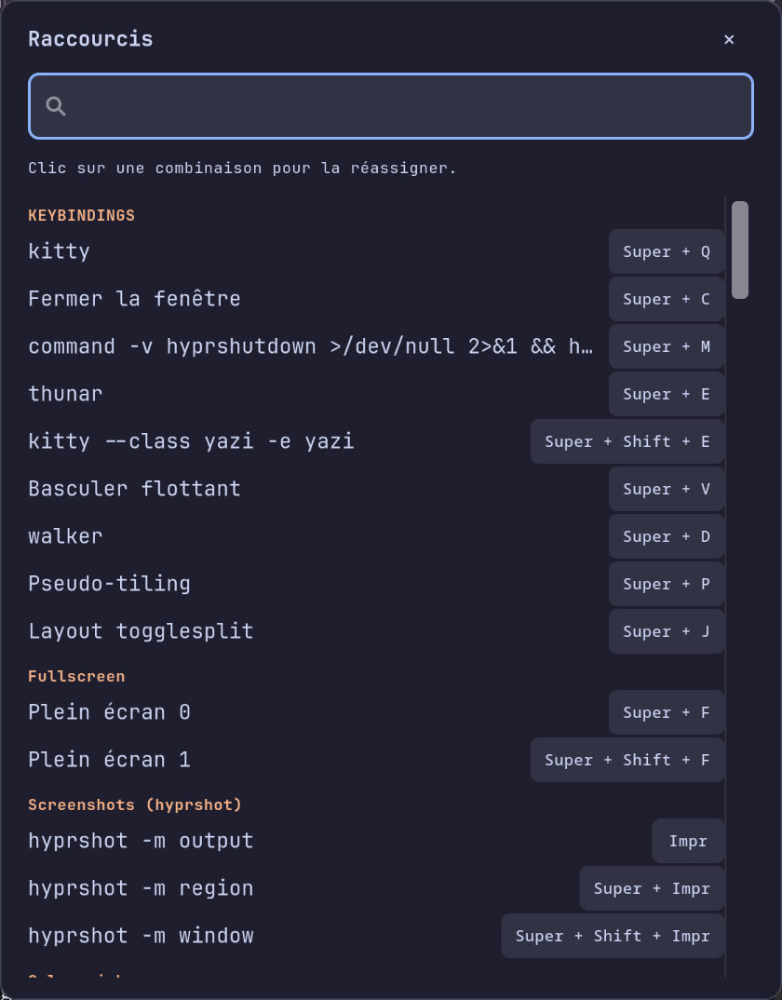
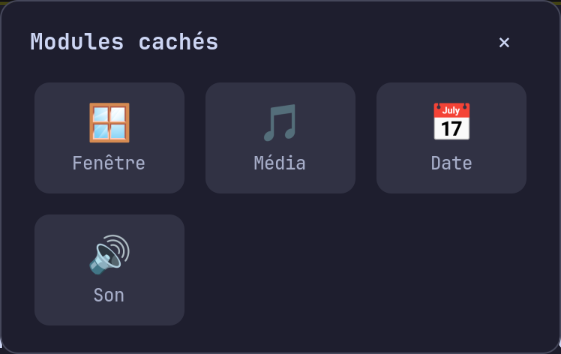

# waybar-gtk-menus

A Waybar setup for Hyprland where every module opens a **native GTK popup**
instead of shelling out to `rofi`/`wofi` menus — Wi-Fi picker, volume mixer,
brightness, battery, Bluetooth, notifications, systemd units, keybindings,
power.

Plus a few things Waybar can't do on its own:

- **Auto-fit** — when the bar runs out of room, the least important modules fold
  into a `⋮` overflow menu instead of overlapping. Priority is configurable.
- **Generated config** — `config-full` is the single source of truth;
  `generate-config.py` produces the config Waybar actually reads, applying
  hidden modules, shared defaults and hardware detection.
- **Stealth mode** — collapse the whole bar to a single eye icon.
- **Claude Code session tracker** — see which of your terminal AI sessions are
  running, done, or waiting on you, and jump to the right window (optional).

> ⚠️ **Language**: the popups' UI strings are currently **French only**.
> The code is otherwise generic — i18n contributions welcome (see *Contributing*).

## Screenshots


| Audio | Keybindings | Overflow |
|-------|-------------|----------|
|  |  |  |

Every module opens a popup like these — anchored under the module, closing on
click-away or `Esc`, styled from the same CSS as the bar.

## Requirements

Arch Linux + Hyprland. Everything else is optional but modules degrade to
"hidden" rather than breaking the bar.

```bash
sudo pacman -S waybar python-gobject gtk3 gtk-layer-shell \
               inter-font ttf-material-symbols-variable \
               networkmanager pipewire-pulse wireplumber brightnessctl \
               playerctl pacman-contrib
# optional, per module:
sudo pacman -S swaync hyprsunset hypridle bluez-utils
```

### Icon font

Icons come from **Material Symbols Rounded** — a single family with a uniform
stroke, rather than a mix of outlined and solid glyphs. Application logos
(Chrome, Firefox, Spotify) stay in Nerd Font, which Material Symbols does not
cover; a brand mark has no reason to follow the system icon grammar anyway.

One catch: Inter and Adwaita Sans both ship ~745 glyphs in the private use
area U+E000–U+F8FF, the same range Material Symbols uses. Being first in the
font stack, they win the lookup and render their own glyphs instead — the
speaker icon comes out as a vertical bar. Reordering the stack is not an
option, since Material Symbols contains A–Z and would take over uppercase
letters in ordinary text.

The fix is to drop that range from the two text fonts. Save as
`~/.config/fontconfig/conf.d/99-icon-pua.conf` and run `fc-cache -f`:

```xml
<?xml version="1.0"?>
<!DOCTYPE fontconfig SYSTEM "urn:fontconfig:fonts.dtd">
<fontconfig>
  <match target="scan">
    <test name="family"><string>Inter</string></test>
    <edit name="charset" mode="assign">
      <minus>
        <name>charset</name>
        <charset><range><int>0xE000</int><int>0xF8FF</int></range></charset>
      </minus>
    </edit>
  </match>
  <!-- repeat the same block for "Adwaita Sans" -->
</fontconfig>
```

They keep all their text coverage; they simply stop offering themselves for
icons.

### Translucent material

The bar and the popups are drawn on a translucent background. GTK3 has no
`backdrop-filter`, so the blur behind them can only come from the compositor.
Without these two rules the background is merely see-through — windows show
through in full detail and the text becomes unreadable. The CSS and the rules
below are two halves of the same thing; do not ship one without the other.

Add to `~/.config/hypr/hyprland.conf` (Hyprland 0.53+ block syntax):

```
layerrule {
    name = waybar-material
    match:namespace = ^(waybar)$
    blur = on
    ignore_alpha = 0.1
}

# The popups set this namespace themselves (menu_common.py). Matching the
# generic `gtk-layer-shell` namespace instead would also catch the fullscreen
# click-away surface, and blur the entire screen whenever a menu opens.
layerrule {
    name = waybar-popup-material
    match:namespace = ^(waybar-popup)$
    blur = on
    ignore_alpha = 0.1
}
```

On Hyprland 0.52 and earlier, the equivalent one-liners are
`layerrule = blur, waybar` and `layerrule = ignorealpha 0.1, waybar`.

A stronger blur than the Hyprland default suits the material — around
`size = 8`, `passes = 3` in the `decoration { blur { ... } }` block. With
opaque windows (`active_opacity = 1.0`) this only affects translucent
surfaces, so the cost is limited to the bar and the popups.

| Module | Needs |
|--------|-------|
| network | `nmcli` (NetworkManager), optionally `nm-connection-editor`, `nmtui` |
| audio | `wpctl` (WirePlumber), `pactl` |
| brightness | `brightnessctl`, `hyprsunset` (night light), `hypridle` |
| notifications / dnd | `swaync` |
| updates | `checkupdates` (pacman-contrib), `yay` for AUR counts |
| media | `playerctl`, Waybar's `mpris` module — title while playing, greyed while paused, nothing when stopped. Left click opens `media-menu.py` (track, prev / play-pause / next, plus a player picker when several are running); scroll skips tracks, middle click goes back, right click toggles Chrome PiP (`wtype`, `jq`, and the Google PiP extension bound to Alt+P) |
| systemd | `systemctl --user` / system units |
| keybindings | Hyprland config in `~/.config/hypr` |
| claude | Claude Code + the hooks in `claude-hooks/` |

Terminal-launching actions assume **kitty**; change the `kitty` calls in
`*-menu.py` if you use something else.

## Install

```bash
git clone https://github.com/USER/waybar-gtk-menus ~/.config/waybar
cd ~/.config/waybar && ./install.sh
```

`install.sh` checks dependencies, recreates the `config` / `style.css`
symlinks, generates `config-active` and restarts Waybar. It never overwrites an
existing `~/.config/waybar` — back yours up first.

## How the config works

```
config-full          source of truth: every module definition + full order
      |
      |  generate-config.py   <- modules-hidden, modules-hidden-auto,
      v                          hardware detection, stealth/tens flags
config-active        what Waybar reads (via the `config` symlink)
```

Never edit `config-active` — it is regenerated. Edit `config-full`, then run
`./generate-config.py && pkill -SIGUSR2 waybar`.

- `modules-hidden` — one module id per line, hidden permanently (set from the
  `⋮` menu).
- `modules-priority` — order in which `autofit.py` folds modules away when the
  bar overflows; **first** line goes first (`compute()` reads the file top to
  bottom, most expendable first).
- `style-normal.css` / `style-remote.css` — themes, swapped by `remote-mode.sh`.

Hardware paths are **detected, not hardcoded**: `"hwmon-path-abs": "auto"` in
`config-full` is resolved at generation time to whatever CPU sensor the machine
exposes (`k10temp`, `coretemp`, …), and dropped if none matches.

## The keybindings module — read this

`keybinds-menu.py` lists your Hyprland binds and lets you **reassign one by
capturing a new combo**. It rewrites the matching line in your own
`~/.config/hypr/hyprland.lua`, then reloads Hyprland.

If you keep a `hyprland.conf` alongside the Lua config as a fallback — the
hyprlang format is deprecated since 0.55 and goes away in 0.57 — the matching
`bind = …` line is rewritten there too, so the fallback cannot silently drift
out of date. When no line matches, the menu says so instead of staying quiet:
that one is yours to port by hand.

Before writing it saves two backups next to the file:

- `hyprland.conf.orig` — state before the *first* ever modification, never
  touched again;
- `hyprland.conf.bak` — state before the *last* modification.

Writes are atomic (temp file + `rename`). Still: this touches your window
manager config. If that makes you uncomfortable, drop `custom/keybinds` from
`group/tools` in `config-full`.

## Claude Code module (optional)

`custom/claude` shows how many [Claude Code](https://claude.com/claude-code)
sessions are running and which ones are waiting on you. It reads state files
written by hooks — without them the module simply renders empty and Waybar
hides it.

```bash
cp claude-hooks/*.sh ~/.claude/hooks/
chmod +x ~/.claude/hooks/*.sh
```

Then register them in `~/.claude/settings.json`:

```json
{
  "hooks": {
    "SessionStart":      [{ "hooks": [{ "type": "command", "command": "$HOME/.claude/hooks/claude-session-start.sh" }] }],
    "SessionEnd":        [{ "hooks": [{ "type": "command", "command": "$HOME/.claude/hooks/claude-session-end.sh" }] }],
    "UserPromptSubmit":  [{ "hooks": [{ "type": "command", "command": "$HOME/.claude/hooks/claude-prompt-state.sh" }] }],
    "Stop":              [{ "hooks": [{ "type": "command", "command": "$HOME/.claude/hooks/claude-stop-notify.sh" }] }],
    "Notification":      [{ "hooks": [{ "type": "command", "command": "$HOME/.claude/hooks/claude-notify-focus.sh" }] }]
  }
}
```

Don't want it? Remove `custom/claude` from `modules-right` in `config-full`.

## Google Calendar module (optional)

`custom/calendar` shows the next meeting — and nothing at all the rest of the
time. The module stays empty (and Waybar hides it) until a timed event is less
than two hours away, then counts down: `1 h 05`, then `12 min · Sprint review`
once the title becomes worth reading, then orange and blinking in the last five
minutes, then blue while the meeting runs. Click opens a popup with the next
few days, click-through joins the Meet link; right click opens Google Calendar.
The clock opens the same popup — it carries the current time, today's date and
ISO week, the next few days, a 24-hour / AM-PM switch, and a card of actions
(new event, open Google Calendar, copy today's date, refresh); the browser
stays one click away instead of being the only thing a click can do.

The clock itself is one block: `clock#date` and `clock#time` live in
`group/datetime`, so hovering either half lights the whole inscription instead
of splitting it into two buttons — while `generate-config.py` can still fold
the date away on its own when the bar runs out of room. Picking **AM / PM** in
the popup drops a `clock-12h` flag next to the config; `generate-config.py`
reads it and switches that module to `%I:%M %p` **and** to `en_US.UTF-8`,
since `%p` renders nothing under a French locale. Its hover calendar turns
English with it — the date half stays local.
Reminders fire at T-10 and T-2 through `notify-send`, with a **Join** button
when the event has a video link.

Reading the calendar needs your own OAuth client — Google does not let a
desktop app ship shared credentials:

1. [console.cloud.google.com](https://console.cloud.google.com) → create a
   project (any name).
2. *APIs & Services* → *Library* → enable **Google Calendar API**.
3. *OAuth consent screen* → **External**, fill the required fields, then add
   your own address under *Test users* (no verification needed for personal
   use).
4. *Credentials* → *Create credentials* → **OAuth client ID** → *Desktop app*.
5. Download the JSON and drop it in place, then authorize:

```bash
mkdir -p ~/.config/waybar-calendar
cp ~/Downloads/client_secret_*.json ~/.config/waybar-calendar/client_secret.json
sudo pacman -S python-google-api-python-client python-google-auth-oauthlib
~/.config/waybar/calendar_agenda.py --auth      # opens the browser once
```

6. Run it on a timer — one tick a minute, one API call every five. The tick
   is what makes a T-10 reminder possible at all; the bar itself never waits
   on the network.

```bash
mkdir -p ~/.config/systemd/user
cat > ~/.config/systemd/user/waybar-calendar.service <<'EOF'
[Unit]
Description=Google Calendar sync and reminders for Waybar
After=graphical-session.target

[Service]
Type=oneshot
ExecStart=%h/.config/waybar/calendar_agenda.py --tick
SuccessExitStatus=0 1 2
EOF

cat > ~/.config/systemd/user/waybar-calendar.timer <<'EOF'
[Unit]
Description=Google Calendar every minute

[Timer]
OnBootSec=45s
OnUnitActiveSec=1min
AccuracySec=5s

[Install]
WantedBy=timers.target
EOF

systemctl --user daemon-reload
systemctl --user enable --now waybar-calendar.timer
```

Credentials and token live in `~/.config/waybar-calendar/`, **outside this
repo** on purpose. `settings.json` in the same folder overrides any of the
defaults declared at the top of `calendar_agenda.py`:

```json
{
  "horizon_min": 120,
  "title_from_min": 15,
  "reminders": [10, 2],
  "calendars": ["you@example.com"],
  "chrome_profiles": {"you@work.example": "Profile 6"},
  "chrome_workspace": 2
}
```

Don't want it? Remove `custom/calendar` from `group/status` in `config-full`.

### Opening an event in the right Chrome profile

Work calendars are usually shared into a personal account, so they all show up
in the popup — but clicking one from the wrong profile gets you *"you do not
have access to this event"*. A Google calendar id **is** an email address, so
`chrome-open.py` maps it to the Chrome profile signed in to that account (read
from `~/.config/google-chrome/Local State`) and opens the link there. Profiles
never signed in to Google declare no account: name those in `chrome_profiles`.
`authuser=` is appended to the URL as well — one profile can hold several
accounts, and Google would otherwise pick the first.

Two things make this less obvious than it sounds. **`--profile-directory` is
only honoured at startup**: with Chrome already running, an URL goes to
whichever window has focus, whatever its profile — only `--new-window` forces
the profile. And **no window says which profile it belongs to**: they all carry
the `google-chrome` class, so neither a `windowrule` nor a lookup can find the
window to reuse. So the script keeps that table itself in `$XDG_RUNTIME_DIR`,
focuses the profile's window and lets Chrome follow the focus, and creates one
only when there is none — `chrome-open.py --record <profile> <address>` lets a
startup script declare the windows it opened.

`chrome_workspace` is where a newly created window lands: it joins the Chrome
window group already sitting there (unlock, spawn, relock — the same trick a
startup layout uses to build that group). `0` leaves the window wherever it
opens.

### Browser media

Chrome publishes title and artist over MPRIS, but only once its media session
is established; until then `Metadata` holds `mpris:length` alone. So
`media-menu.py` reads MPRIS first and falls back to the Hyprland window title
only when that comes back empty — the window title is the *active tab's*, which
is what you are looking at, not necessarily what is playing.

That distinction drives `mpris-pip.sh`, which has two modes, because the PiP
shortcut only ever reaches the active tab of the focused window and nothing
from outside can select a tab (Chrome reports `CanRaise = false` and publishes
no `xesam:url`):

| Call | Means | Target |
|------|-------|--------|
| `mpris-pip.sh` (right click) | "pop out what I'm looking at" | most recently focused Chrome window |
| `mpris-pip.sh --playing` (menu) | "pop out what is playing" | window whose title carries the MPRIS title; notifies if none does |

Matching strips Unicode direction marks — YouTube wraps channel names in them,
so the window title carries them and the MPRIS title does not.

**Known limit**: a video playing in a background tab cannot be popped out. The
menu says so rather than popping out a different video, which is what the two
earlier versions did — first by picking an arbitrary Chrome window, then by
picking whichever window's title said "YouTube".

## Layout

| File | Role |
|------|------|
| `menu_common.py` | shared GTK layer-shell popup base — all menus build on it |
| `modules_registry.py` | single inventory of the bar's modules, shared by the eye menu and the `⋮` menu |
| `generate-config.py` | `config-full` → `config-active` |
| `autofit.py` | folds modules away when the bar overflows |
| `calendar_agenda.py` | Google Calendar: OAuth, sync, reminders, module JSON |
| `chrome-open.py` | opens an URL in a given Chrome profile, on a given workspace |
| `*-menu.py` | one popup per module |
| `*.sh` | small stateless helpers (toggles, watchers, status JSON) |

## Contributing

This is a personal config, published as-is: **Arch + Hyprland only**, no
support guaranteed. PRs are welcome, especially:

- **i18n** — extracting the French UI strings would be the single most useful
  contribution;
- portability to other compositors (the Hyprland coupling is limited to
  `hyprctl` calls and the workspaces module).

Open an issue before a large PR so we don't duplicate work.

## License

MIT — see [LICENSE](LICENSE).
